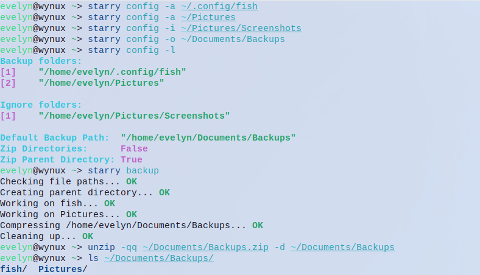

# Starry

Starry is a simple, cross-platform, backup tool written in C#.

## Installation
### Pre-requisites
Starry is written in C#, and it uses python for the setup.
To install Starry, you will need to also install dotnet and python.

#### For Linux
```bash
# Fedora
sudo dnf in dotnet-runtime-8.0 dotnet-sdk-8.0 python3

# Arch
sudo pacman -S dotnet-runtime dotnet-sdk python

# Ubuntu based distributions
sudo pacman -S dotnet-runtime-8.0 dotnet-sdk-8.0 python3
```
#### For Windows
Using choco
```bash
choco install python dotnet
```
Manually <br>

Visit the following sites. <br>
https://learn.microsoft.com/en-us/dotnet/core/install/windows?tabs=net80 <br>
https://www.python.org/downloads/

That's it! You are now ready to install Starry.

### Using setup.py
```bash
git clone https://github.com/its-Lyn/Starry
cd Starry/

python setup.py help

# After you've read the help. You can install it.
python setup.py build

# On Linux
sudo python setup.py install

# On Windows, you need to open powershell as administrator.
python setup.py install

starry help
```

### Compiling without setup.py
```bash
git clone https://github.com/its-Lyn/Starry
cd Starry/

dotnet publish -c Release -p:PublishSingleFile=true
cd Starry/bin/Release/net8.0/<your-os>-<your-arch>/publish

# On Linux
sudo mv ./Starry /usr/local/bin/starry

# On Windows, you need to open powershell as administrator
Move-Item .\Starry C:\Windows\system32

starry help
```

## Usage


Starry has a small config system. If you'd like to learn more, please take a look at the [documentation](./Documentation/Config.md)

## License
MIT